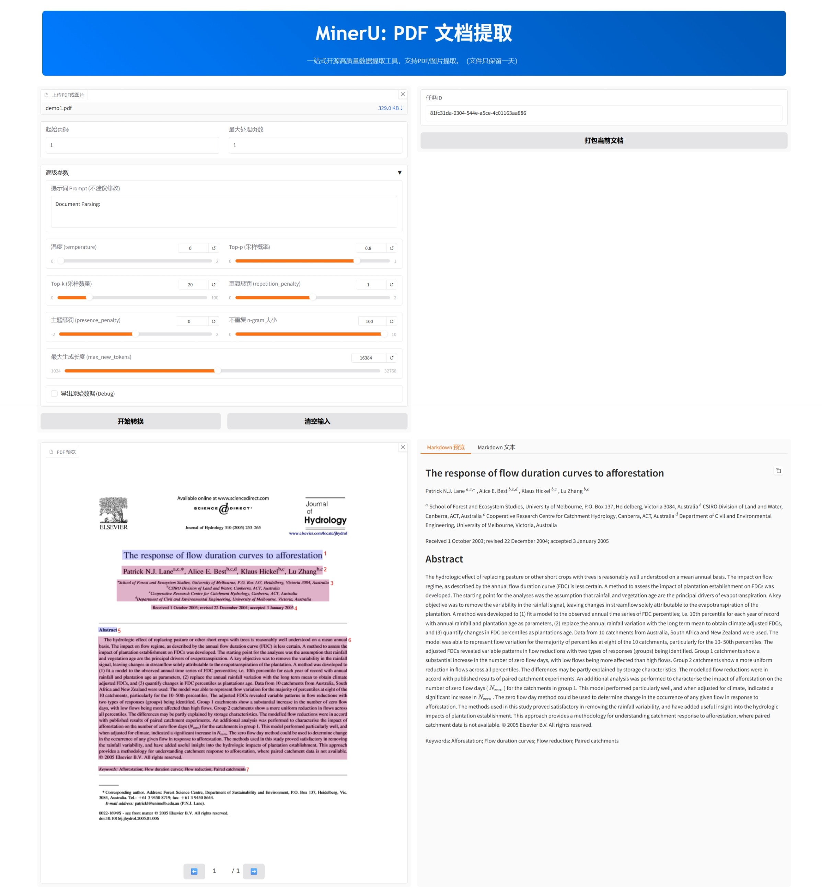

# MinerU VLM App

提供 MinerU 2.0 VLM 的在线 Web 服务（基于 Gradio）

支持 PDF/JPG/JPEG/PNG 文件一键转为 Markdown

## 特性

1. 离线本地化部署（Gradio 已做离线运行适配）
2. VLM 镜像模型文件与镜像分离
3. VLM 镜像仅使用`mineru[vlm]`减小镜像体积
4. VLM 镜像默认启动`sglang-server`
5. VLM 镜像内提供默认位置的`mineru.json`配置文件
6. Web 界面提供详细参数配置功能
7. 功能模块参考官方 Pipeline 与 VLM 版本的 Web Demo 实现

## 使用方法

**使用前请先安装 Docker，并启动 Docker 服务**

1. 把项目下载到本地
2. 手动下载[MinerU2.0-2505-0.9B](https://www.modelscope.cn/models/OpenDataLab/MinerU2.0-2505-0.9B)到`./docker/compose-data/models/`目录下
3. 打开`./docker`目录，使用`docker compose up -d`启动镜像
4. 等待容器启动，访问`http://localhost:7860`

## 展示效果

---

感谢 OpenDataLab 对开源社区的贡献

更多 MinerU 信息详见：[opendatalab/MinerU](https://github.com/opendatalab/MinerU)
